# **6T SRAM Bitcell Design Document**
### *ECE 298A — TinyTapeout / Sky130 1.8V CMOS*
### *Author: Robert Tang*

---

## **1. Introduction**
- The standard 6T architecture consists of two functional blocks:
1.  **Storage Element (The Core):** Two cross-coupled CMOS inverters (M1-M4) form a bistable latch. If noise perturbs the internal node voltage, the positive feedback loop drives it back to the supply rails ($V_{DD}$ or $GND$), ensuring data integrity.
2.  **Access Control (The Interface):** Two NMOS "Pass-Gate" transistors (M5-M6) isolate the sensitive storage nodes from the heavy bitlines during the "Hold" state and provide a controlled path for data transfer during "Read" and "Write" operations.
- The cell must perform three distinct operations reliably:
1. **Hold (Standby):** The Wordline (WL) is low. Access transistors are OFF, isolating the latch. The cross-coupled inverters reinforce the stored data against leakage currents and noise.
2. **Read:** The Bitlines (BL/BLB) are precharged to $V_{DD}$. The WL goes high. The cell must discharge one bitline slightly without flipping its own internal state ("Read Stability").
3. **Write:** One bitline is driven to $0V$, and the other to $V_{DD}$. The WL goes high. The access transistors must overpower the internal inverters to force the new value into the cell ("Write Ability").
- Tools used: Xschem, Ngspice, Magic, Python 
- Overall design flow (schematic → simulation → layout → extraction → post-layout sim)
### **1.1. Target performance goals**

| Category | Target | As % of VDD | Comments |
| ----- | ----- | ----- | ----- |
| **Supply** | 1.8 V | 100% | Standard definition from TinyTapeout |
| **Hold SNM** | **0.40–0.60 V** | \~22–33% | High safety margin needed to prevent background noise from flipping the bit |
| **Read SNM** | **0.20–0.30 V** | \~11–17% | Need Read SNM to prevent destructive read |
| **Write SNM** | **0.70–0.90 V** | \~39–50% |  |
| **Access Time** | **0-200ps** | / | Clock speed: assuming 50MHz (clk period: 20ns)  |
| **Read Time** | **0-200ps** | / |  |

Device Ratios:
| Ratio | Definition (geometric) | Conservative target | Notes |
| ----- | ----- | ----- | ----- |
| **CR** (cell ratio) | Wpd / Wax | **1.8 – 2.2** | Larger CR \= better **read** SNM, worse write |
| **PR** (pull-up ratio) | Wpu / Wax | **0.9 – 1.2** | Smaller PR \= easier **write**, slightly worse hold |


# **2. Schematic Design**

## **2.1 Final Schematic**
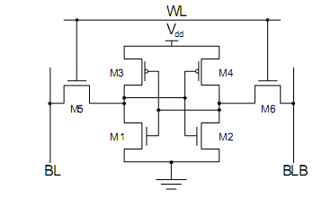

Schematic in Xschem:
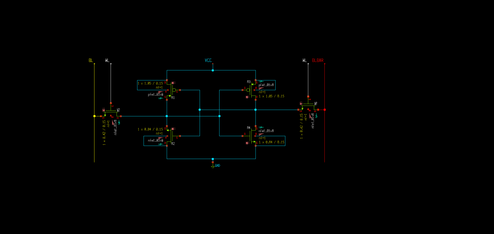

## **2.2 Transistor Sizing**

I started with some initial parameters, but found they did not meet the Write SNM targets. Through iteration, I converged on the following final dimensions to balance Read Stability (High Cell Ratio) against Write Ability (Low Pull Ratio).

| Device | Type | W (µm) | L (µm) | Notes |
| :--- | :--- | :--- | :--- | :--- |
| **Pull-up PMOS** | PFET | **0.42** | 0.15 | Sized to minimum width to weaken the latch, improving Write Ability. |
| **Pull-down NMOS** | NFET | **0.84** | 0.15 | Sized 2x wider than Access transistor to ensure robust Read Stability (Cell Ratio = 2.0). |
| **Access NMOS** | NFET | **0.42** | 0.15 | Sized to minimum to reduce bitline capacitance while maintaining drive strength. |

*(Note: Length L=0.15µm is standard for Sky130 logic devices)*

**Comments on Sizing Decisions:**

| Iteration | W_pu (µm) | W_pd (µm) | W_ax (µm) | Pull Ratio (PR) | Write SNM | Status |
| :--- | :--- | :--- | :--- | :--- | :--- | :--- |
| **Iter 0** | 0.50 | 0.84 | 0.42 | 1.19 | **0.62 V** | *Failed (Write SNM < 0.7V)* |
| **Iter 1** | **0.42** | 0.84 | 0.42 | **1.00** | **0.71 V** | **Passed** |

# **3. Pre-Layout Simulation**
## **3.0 Testbench Set-up**
Using Ngspice, I wrote two testbenches for the output .spice file: DC Sweeps for stability analysis (SNM) and Transient Analysis for timing analysis.

### Static Noise Margin (SNM) Testbench
**File:** [`testbench_snm.spice`](../Simulations/Post-Layout/Testbench/testbench_snm.spice)

To generate the standard "Butterfly Curves," I implemented a DC sweep testbench using a "variable resistor" technique to isolate and drive the internal nodes without changing the netlist topology.

* **Technique:** High-value resistors (`100G`) and low-value resistors (`1m`) are switched using `alter` commands to alternate between "forcing" a voltage on one node and "measuring" the response on the other.
* **Modes Tested:**
    1.  **Hold SNM:** Wordline (WL) grounded (0V). The cell is isolated.
    2.  **Read SNM:** Wordline (WL) clamped to VDD (1.8V) with both Bitlines precharged to VDD. This simulates the most vulnerable state during a read access ("Read Disturb").
    3.  **Write SNM:** Wordline (WL) clamped to VDD (1.8V), but with one Bitline grounded (0V). This tests the cell's ability to be overpowered by the write driver.

* **Calculation (Python):**
The raw voltage data is processed by [`plot_snm.py`](../Simulations/Pre-Layout/Testbench/plot_timing.py), which automaticaly finds the maximum squre (and thus the SNMs).

### Access Time (Timing) Testbench
**File:** [`testbench_timing.spice`](../Simulations/Pre-Layout/Testbench/plot_timing.py)

Performance was measured using transient simulations (`.tran`) with realistic parasitic loading conditions.

* **Setup:**
    * **Initial Conditions:** The cell is initialized using `.ic` commands (e.g., Q=1.8V, Qbar=0V) to ensure a known state at T=0.
    * **Bitline Load:** A capacitive load (`C_BL_LOAD = 50fF`) is added to the bitlines to simulate the wire capacitance of a column in a memory array.

* **Metric 1: Write Access Time**
    * **Definition:** The time delay between the Wordline rising edge (50% VDD) and the internal storage node Q flipping state (crossing 50% VDD).
    * **Stimulus:** Bitline (BL) is driven to 0V; Wordline is pulsed high. This measures how fast the write driver can overpower the internal Pull-Up transistor.

* **Metric 2: Read Access Time**
    * **Definition:** The time required for the cell to discharge the bitline by **50mV** (Standard Sense Amplifier threshold).
    * **Stimulus:** Bitlines are precharged to 1.8V and left floating (High-Z). Wordline is pulsed high.
    * **Measurement:** The script measures the time from WL rising until the differential voltage $(V_{BL} - V_{BLB}) \ge 50mV$.

## **3.1 Read Static Noise Margin (SNM)**

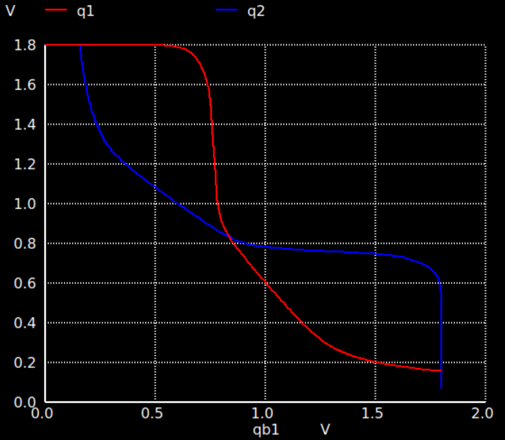
Read SNM: 0.24V

## **3.2 Hold SNM**

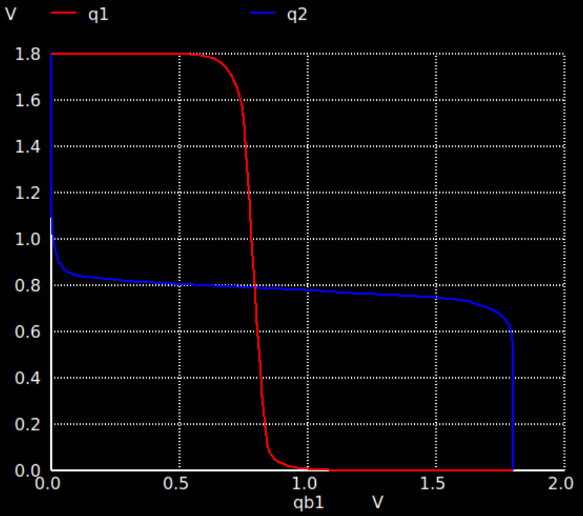
Hold SNM: 0.45V

## **3.3 Write SNM**

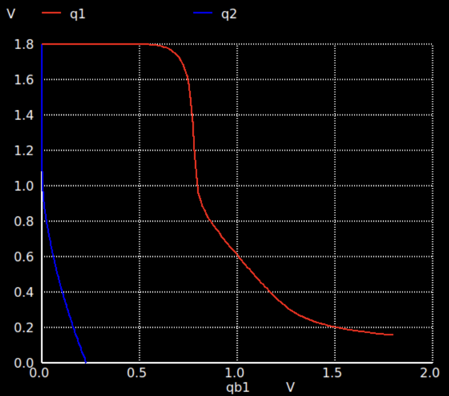
Write SNM: 0.71V

## **3.4 Prelayout Timing Tests**
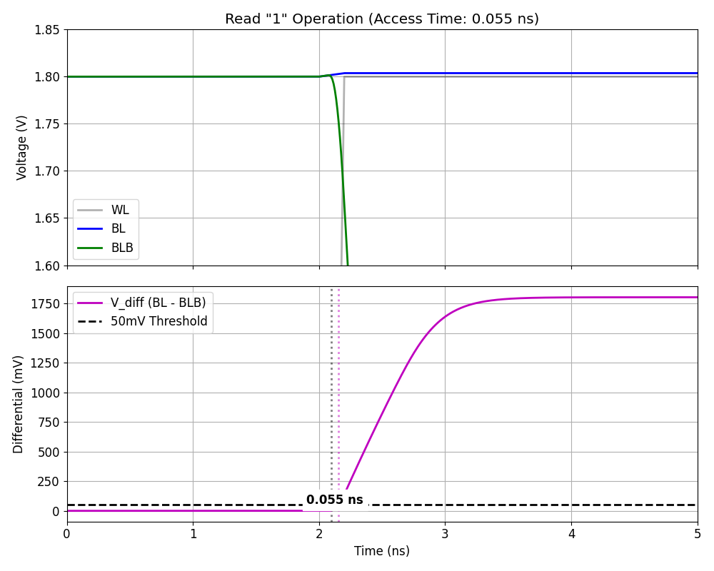
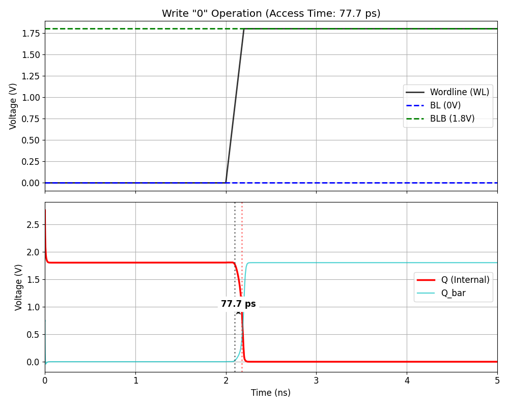

## **3.5 Summary of Pre-Layout Simulation Results**
| Metric | Target Specification | Pre-Layout Simulation | Status |
| :--- | :--- | :--- | :--- |
| **Hold SNM** | 0.40-0.60 V | **0.45 V** | **Pass** |
| **Read SNM** | 0.20-0.30 V | **0.24 V** | **Pass** |
| **Write SNM** | 0.70-0.90 V | **0.71 V** | **Pass** |
| **Write Access Time**| < 200 ps | **77.7 ps** | **Pass** |
| **Read Access Time** | < 200 ps | **55.0 ps** | **Pass** |
# **4. Layout Design**
After I have done initial layout (I just randomly referred a picture online for layout) I came across [this paper](https://www.researchgate.net/publication/312094888_Design_and_Simulation_of_6T_SRAM_Cell_Architectures_in_32nm_Technology), where it talks about classification of 6T SRAM designs, and their performance. So I think it is worth noting here. (I was initially laying out similar to the "Type-1a cell")
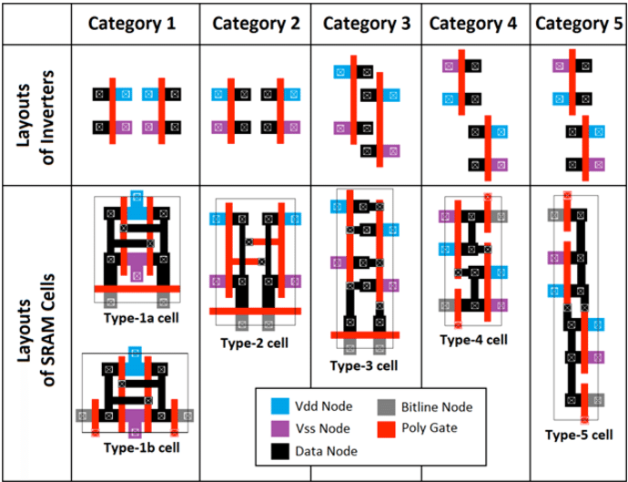
And during one meeting, Prof. Long suggested me to share the ground of the inverter pairs, which would further reduce the size of the cell. So in the end I ended up trying out two different options: Type-1a and Type-1b cell.

## **4.1 Type-1a**

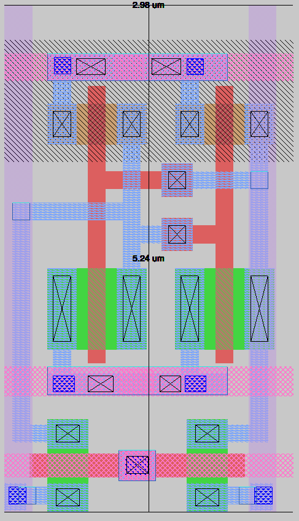

**Final Dimensions:** *2.98 µm width × 5.24 µm height*  


### Design Approach
Type-1A was designed with the primary objective of achieving the **minimum possible cell height**, producing an extremely compact 6T SRAM bitcell while staying fully compliant with Sky130 DRC rules.

### (1) Device Placement
- The **cross-coupled inverter pair** is placed in a perfectly mirrored configuration to ensure **left–right symmetry**, which is crucial for matched SNM and balanced switching.  
- **Pull-down NMOS pair** (green diffusion) is placed close to the bitline contacts to improve **read stability**.  
- **Pull-up PMOS pair** (brown diffusion) is placed in a shared **single N-well** at the top.  
- **Access transistors** share diffusion with the inverter nodes, minimizing node capacitance and internal routing length.

### (2) Routing Strategy
- **Vertical M1 rails** are used for the bitlines (BL and BLB).  
- **Horizontal M2 rails** have: WL; VDD; GND

Visualizaiton of 4*4 bit array: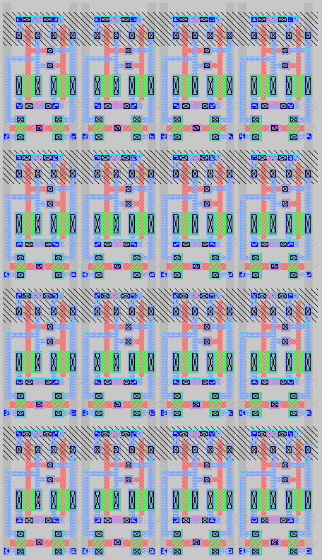
## **4.2 Layout Option 1B**
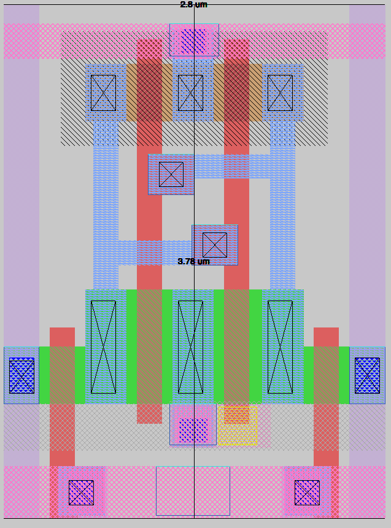
**Final Dimensions:** *2.8 µm width × 3.78 µm height* 

Since this layout was designed during the end of term, there are too much things going on and it wasn't very well-polished, but it offers an even smaller size in comparison to the tall layout (type1a).
(Will finish type1b later after finals, so going with Type1a for now)

## **4.3 DRC Report**


✔ DRC Clean  :)


## **4.4 LVS Report**
[LVS_Report](../Layout/LVS/lvs_report.out)

✘ Couldn't get the LVS report to match, since the lvs cotains parasitic capacitances, but visually inspecting the netlists they matched ✔ (not sure what's the correct way of doing this)


# **5. Parasitic Extraction & Post-Layout Simulation**

## **5.1 Extracted Netlist**
- Using `extract all`  
- Running `ext2spice`  (made sure it's LVS friendly)
- Parasitic R and C elements  
  
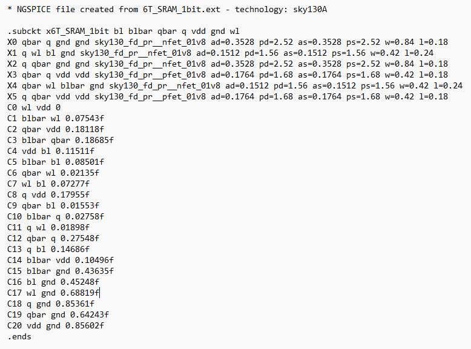


## **5.2 Post-Layout SNM Results**
Using the same testbench as the above (changing the netlist to be tested) we got the below results
### **Post-Layout Hold SNM**
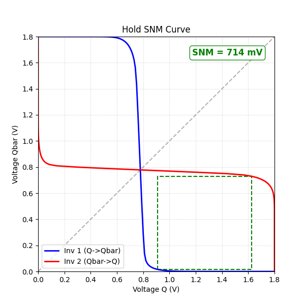
### **Post-Layout Read SNM**
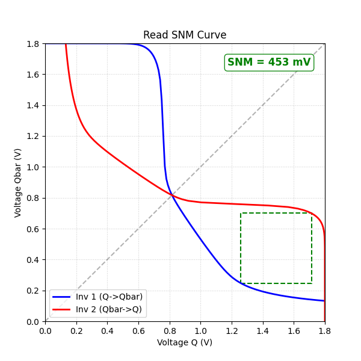
### **Post-Layout Write SNM**
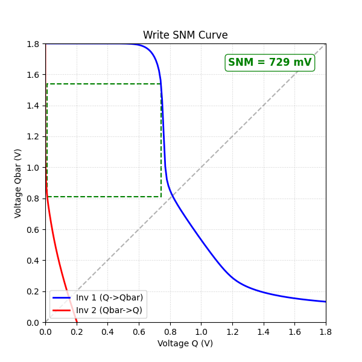

## **5.3 Post-Layout Timing Analysis**
To simulate bitline load capacitiances I simulated the results for three different values: 50f, 500f, and 1000f to simulate real world values.
### **Access Time**
| C | Read Access Time | Write Access Time|
|--------|------------|------------|
| 50f | 46ps| 69.1ps |
| 500f | 233ps| 69.1ps |
| 1000f |440ps | 69.1ps |


# **6. Summary Comparison Table**

| Metric | Target | Pre-Layout | Post-Layout |
|--------|------------|-------------|--------|
| Hold SNM |0.40-0.60 V |0.45 V | 0.714 V|
| Read SNM |0.20-0.30 V |0.24 V |0.453 V |
| Write SNM |0.70-0.90 V |0.71 V |0.729 V |
| Read Access Time (50f) |<200ps | 55ps| 46ps|
| Write Access Time (50f) | <200ps|77.7ps | 69.1ps|

Comments:
* One big source of error is that in pre-layout, the values were estimated suing simiplified "side-of-squre" approximation from the waveform viewer, I did not got the chance to change to calcualte using the python function I have developed. 
* Write SNM is within the targeted range, which is good, while although Hold SNM exceeds the targeted value, it is 40% of VDD and still fairly robust. The Read SNM, is also good to ensure that the cell not likely will have Read Disturbance. 

# **7. Challenges Encountered**
There are many, many challenges that I have encoutnerd duirng this projects. While the first and foremost being that I had no experience in analog chip design or chip design in general, that, is also why i signed up for this course, wanting to learn more about chip designs. By the end of the course, i won't say i am an expert in chip designs but it builds me a good understanding of the whole chip design process, from design to layout to tapeout, making me somewhat interested in learning more about it. 
Another big struggle is to getting the pdk to work on my computer. At first i tried installing the pdk on my windows environment, but i encountered many issues, and couldn't get the pdk working. So i installed linux (wsl) for the first time, and used linux to run all the simulation. and I changed from LTSpice to the Ngspice+Xschem combo, and learnt the general analog circuit design flow from youtube, things become a lot more smoother
as more specific to the actual design problems, there are countless times that the simulations are not working, or the layout has drc errors, for example i had around 100 drc errors when trying to connect the bits in arrays, and to quickly identify what the drc error is about, i looked up the drc error using the builtin drc find tool, as well as the sky130 tech files, to see what is wrong with my layout
(e.g., device model issues, incorrect pin ordering)

# **8. Test Plan**
See [this detailed test plan](Test_Plan.md)

# **9. Github Repo Structure**

The repository is organized to separate the schematic design, physical layout, and verification environments.


```text
/ (root)
  ├─ .github/           
  ├─ Layout/           ← Layout files  
  ├─ Netlist_spice/    ← SPICE netlists & extraction output  
  ├─ Schematics/       ← Schematic in Xschem  
  ├─ Simulations/      ← Simulation data  
  ├─ docs/             ← Documentation folder  
  ├─ src/                
  ├─ test/             
  ├─ .gitignore  
  ├─ LICENSE  
  ├─ README.md  
  └─ info.yaml         ← Project metadata  

```
# **10. References**

- Conventional 6T SRAM Cell Diagram  
  https://www.researchgate.net/figure/Conventional-6T-SRAM-Cell-7_fig1_271304374

- "Design and Simulation of 6T SRAM Cell Architectures in 32nm Technology"  
  https://www.researchgate.net/publication/312094888_Design_and_Simulation_of_6T_SRAM_Cell_Architectures_in_32nm_Technology

- Sky130 6T SRAM Prelayout SPICE Example (vsdsram project)  
  https://github.com/Deepak42074/vsdsram_sky130/blob/main/Ngspice_Netlist/Prelayout/6T_sram_cell.spice

- SkyWater SKY130 Open-Source PDK Documentation  
  https://skywater-pdk.readthedocs.io/en/main/

- TinyTapeout Analog Design Specifications  
  https://tinytapeout.com/specs/analog/

- **Sedra & Smith, *Microelectronic Circuits*, 8th Edition.**  
  (Primary reference for transistor behavior, inverter operation, and SRAM fundamentals)

- Video Reference — Magic VLSI Tutorial with Sky130 PDK  
  https://www.youtube.com/watch?v=a6pJenKlL1k
